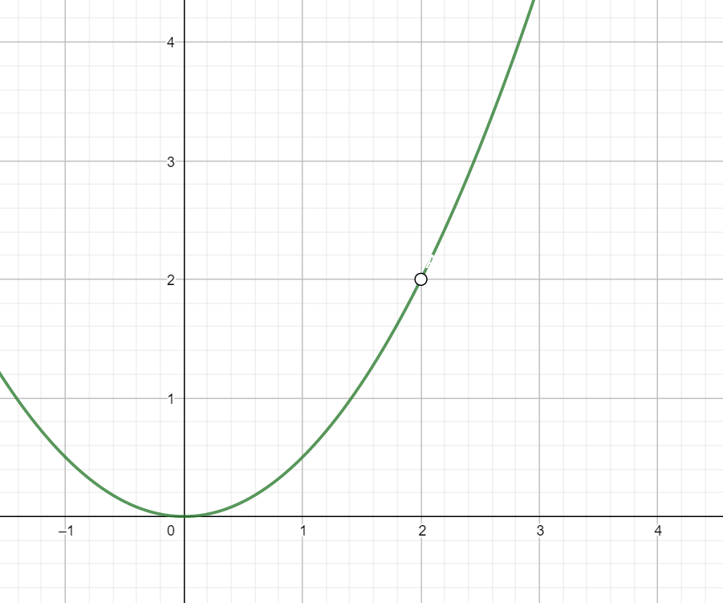
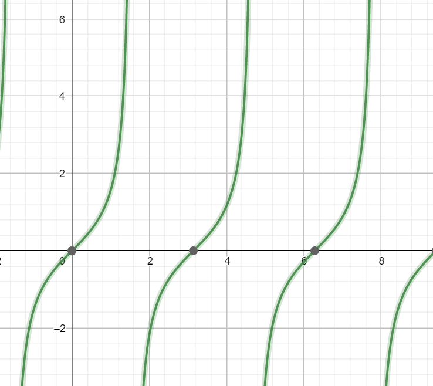
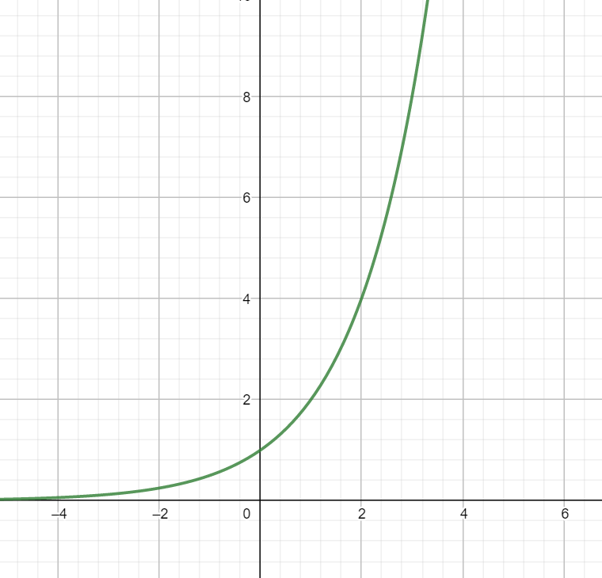

# 1.8 Continuity and Discontinuity of Function

1. $$ x \to a,x \not= a.\quad \lim\limits_{x \to a}f(x) $$ has no relation with $f(a)$.

2. $\lim\limits_{x \to a}f(x)$ and $f(a)$ situation

   pic of removable break point	 

      $f(a-0)=f(a+0)=A \not=f(a)$

      pic of jump break point
   

   $f(a-0) \not= f(a+0)=f(a)$ or $f(a-0)=f(a) \not= f(a+0)$

   pic of tan(x)

# Continuity

## 1. The function continues at one point

$ \lim\limits_{x \to a} = f(a) $
or
$ f(a-0)=f(a+0)=f(a) $
three point :(left limit, right limit and function value are equal.

## Note

1. $f(a-0) = f(a)$ called left continue.
 	2. $f(a+0) = f(a)$ called right continue.

eg1:
$$
f(x)=\left \{
\begin{aligned}
x = \frac{e^{ax}-1}{ln(1+x)},x>0 \\
\frac{b}{1+x^2} ,x<0 \\
2,x=0 	\\
\end{aligned}
\right.
$$

### Question:

$f(x)$ continue at $x=0$ , what is a,b?

### Solution:

$$
f(0+0)=\lim_\limits{x \to 0^+}f(x)=\lim_\limits{x \to 0^+} \frac{e^{ax}-1}{ln(1+x)}=\frac{ax}{x}=a;
$$

*use infinitesimal to swap.*
$$
f(0)=2;\\
f(0-0)=\lim\limits_{x \to 0^-}f(x)= \lim\limits_{x \to 0^-} \frac{b}{1+x^2}=\frac{b}{1}=b
$$
$ \because f(x) $ continues at $ x=0 $
$ \therefore f(0-0)=f(0+0)=f(0) $
$ \therefore a=2,b=2 $

## 2. $ f(x) $ continues at closed interval

set $ f(x) $ continues at $ [a,b] $
1. $ f(x) $ continues at any point on $ (a,b) $
Three equal: left limit, right limit and function value are equal.
2. Need to consider: $ f(a)=f(a+0),\quad f(b)=f(b-0) $
	called $ f(x) $ continues on $ [a,b] $
    $ f(x) \in \subset [a,b] $
    $ %well, I'm not sure about this symbol \subset? $
    $ \subset [a,b] $ means a set which consist of all functions on $ [a,b]$

# The type of break point

## 1. Break point
If $ \lim\limits_{x \to a}f(x) \not= f(a) $ called $ f(x) $ break at $ x=a $

## 2. Type
### 1. First kind of break point

$ f(a-0)、f(a+0) $ exist
$$
\begin{equation}
f(a-0)=f(a+0)
x=a \\
\text{is removable break point} \\
\end{equation}
$$

$$
\begin{equation}
f(a-0) \not= f(a+0) \\
x=a \quad \text{is jump break point of}f(x)
\end{equation}
$$

### 2. Second kind of break point

$ f(a-0)、f(a+0) $ at least one of them doesn't exist

### Question 2

$ f(x)=\frac{x^2-3x+2}{x^2-1} $ ask for break point and its type for $ f(x) $

### Solution:

$$
\begin{align}
&x=\pm 1 \quad \text{is break point of} \quad f(x) \\
\\
&\because
\lim\limits_{x \to -1}f(x)=
\lim\limits_{x \to -1} \frac{x^2-3x+2}{x^2-1}=
\infin \\
\\
&\therefore x=-1 \quad \text{is the second break point of} \quad f(x) \\
\\
&\because
\lim\limits_{x \to 1}f(x) =
\lim\limits_{x \to 1} \frac{(x-2)(x-1)}{(x+1)(x-1)}=
\lim\limits_{x \to 1} \frac{x-2}{x-1}=
-\frac{1}{2} \\
\\
&\text{that mean} \quad f(1-0)=f(1+0)= -\frac{1}{2}	\\
\\
&\therefore x=1 \text{is the removable break point}
\end{align}
$$

### Question3
$$
f(x)=\frac{x}{sinx} \quad \text{ask for break point}	\\
$$
### Solution:
$$
\begin{align}
&x=k\pi(k \in z) \quad \text{is break point of } f(x) \\
\\
&\because
\lim\limits_{x \to 0}f(x) =
\lim\limits_{x \to 0} \frac{x}{sinx}=1 \\
\\
&\text{that mean }f(0-0)=f(0+0)=1	\\
\\
&\therefore x=0 \quad
\text{is removable break point for }f(x)	\\
\\
\text{also}
&\because \lim\limits_{x \to k\pi}f(x)= \infin
(k\in z \quad \text{and} \quad k \not= 0)	\quad	\\
\\
&\therefore x=k\pi (k\in z \quad \text{and} \quad k \not= 0)	\quad
\text{is second kind break point of }f(x)
\end{align}
$$

## Note

$$
\begin{align}
&y=a^x(a>1)	\\
\\
\text{when } a>1	\\
\\
&\lim\limits_{x \to -\infin}a^x=0, \quad
&&\lim\limits_{x \to \infin}a^x=+\infin,	\\
\\
\text{eg:}
&\lim\limits_{x \to 0^-}e^\frac{1}{x}=0
&&\lim\limits_{x \to 0^+}e^\frac{1}{x}=+ \infin	\quad

\end{align}
$$

### Question 4
$$
f(x)= \frac{ 1-2^\frac{1}{x} }{ 1+2^\frac{1}{x} }	\\
\\
\text{ask for break point}
$$

### Solution
$$
\begin{align}
&x=0 \quad \text{is break point of }f(x)	\\
\\
&f(0-0) =
\lim\limits_{x \to 0^-}f(x) =
\lim\limits_{x \to 0^-} \frac{ 1-2^\frac{1}{x} }{ 1+2^\frac{1}{x} }
=	1;	\\
\\
&(\quad 2^\frac{1}{x} \to 0 ,\quad (x \to \infin)\quad )	\\
\\
&f(0+0)=
\lim\limits_{x \to 0^+} \frac{ 1-2^\frac{1}{x} }{ 1+2^\frac{1}{x} }=
\lim\limits_{x \to 0^+} \frac{ \frac{1}{ 2^\frac{1}{x} }-1 }
{ \frac{1}{ 2^\frac{1}{x} }+1 }
=-1;
\\
&(\quad \frac{1}{ 2^\frac{1}{x} } \to 0, \quad x \to \infin)\\
\\
&\because f(0-0) \not= f(0+0)	\\
\\
&\therefore x=0	\quad
\text{is jump break point of }f(x)

\end{align}
$$

2020/3/6~2020/3/7

shangcode
